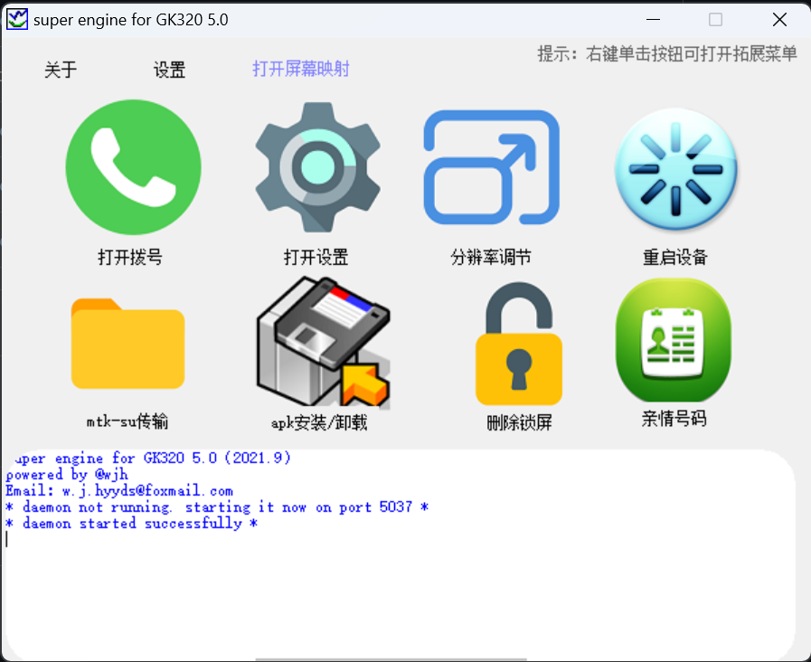

# super-engine-for-GK320
# ✅提供GK320/GK310智能电子学生证的破解服务  
  
## 这本来是我高一(2020)用易语言写的，到高二基本完成所有工作，旨在破解这个学生证，给无聊的高中生活加点乐趣，现在毕业了分享给大家，其中离不开我同学的帮助，在这里一并感谢他们

# 🩹使用说明
下载release压缩包解压后进行以下操作：  
### 1.首先打开ADBDriverInstaller.exe这个程序，将学生证连接到电脑(注意：学生证自带的数据线是不支持数据传输的，仅能充电，所以请使用其他数据线)  
### 2.点击refresh按钮刷新，看到下方出现设备后，点击install(这步是安装adb驱动，以进行下一步工作)  
### 3.驱动安装完成后即可打开super engine for GK320.exe这个程序，页面如下  
  
### 出现此页面即为成功  
### 4.单击mtk-su传输按钮，出现传输完成即可(这步是利用这个文件获取临时root权限)，一部学生证仅进行一步此操作
### 5.接下来即可进行其他操作，根据需要即可  

# 🔎软件的一些说明  
### apk安装：  
普通安装：安装至/data/app/ 目录，即正常安装目录，安装完可正常卸载  
系统预装目录：安装至系统预装目录，可正常卸载，但文件不会删除，恢复出厂设置后仍自动安装  
系统目录：安装至系统目录：此目录下的软件不能卸载，一般是系统软件，普通软件安装至此目录可能会有问题

### 软件安装问题  
部分软件安装至普通目录或系统预装目录出现问题，可进行覆盖安装(下文)

### 覆盖安装  
由于系统限制，不能在学生证上直接安装程序，但是可以覆盖安装  
先在学生证安装一个图形桌面，即手机桌面程序，推荐x桌面，然后安装文件管理器，推荐mix管理器，在里面打开apk安装包进行覆盖安装  

# 🩻注意  
一定不要在学生证设置里面的开发者设置乱搞！！！防止变砖（我高中时就有好多同学好奇去点导致手机变砖！）
